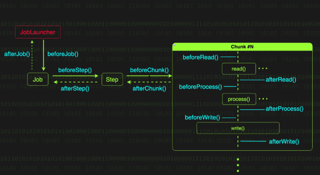

# Spring Batch Listener 와 활용

## JobExecutionListener

- Job 실행의 시작과 종료 시점에 호출되는 리스너 인터페이스다.
- Job 실행 결과를 이메일로 전송하거나, Job 이 시작하기 전에 필요한 리소스를 준비하고 끝난 후에 정리하는 부가 작업을 수행

**afterJob()** 메서드는 잡 실행 정보가 메타데이터 저장소에 저장되기 전에 호출된다.  
이를 활용하면 특정 조건에 따라 Job 의 실행 결과 상태를 완료(`COMPLETED`) 에서 실패 (`FAILED`)로 변경하는 것도 가능하다.

```java
public interface JobExecutionListener {
  default void beforeJob(JobExecution jobExecution);

  default void afterJob(JobExecution jobExecution);
}
```

## StepExecutionListener

- Step 실행과 종료시점에 호출되는 리스너 인터페이스

```java
public interface StepExecutionListener extends StepListener {
  default void beforeStep(StepExecution stepExecution) {
  }

  @Nullable
  default ExitStatus afterStep(StepExecution stepExecution) {
    return null;
  }
}
```

- `afterStep` 메서드를 보면 ExitStatus 를 반환하는 것을 알 수 있는데, 이를 통해 afterStep() 에서 특정 조건에 따라 Step 의 실행 결과 상태를 직접 변경할 수 있다.

## ChunkListener

- ChunkListener 는 하나의 청크 단위 처리가 시작되기 전, 완료된 후, 그리고 에러가 발생했을 때 호출되는 리스너 인터페이스

```java
public interface ChunkListener extends StepListener {
  default void beforeChunk(ChunkContext context) {
  }

  default void afterChunk(ChunkContext context) {
  }

  default void afterChunkError(ChunkContext context) {
  }
}
```

- `afterChunk` 는 트랜잭션이 커밋된 후에 호출된다.
- 반면 청크 처리 도중 예외가 발생하는 경우 `afterChunkError` 가 호출되는데, 이는 청크 트랜잭션이 **롤백**된 이후에 호출된다.

## Item[Read|Process|Write]Listener

- Item[Read|Process|Write]Listener 는 아이템의 읽기/처리/쓰기 작업이 수행되는 시점에 호출되는 리스너 인터페이스 이다.
- 아이템 단위의 처리 전후와 에러 발생 시점에 호출된다.

```java
// ItemReadListener.java
public interface ItemReadListener<T> extends StepListener {
  default void beforeRead() {
  }

  default void afterRead(T item) {
  }

  default void onReadError(Exception ex) {
  }
}

// ItemProcessListener.java
public interface ItemProcessListener<T, S> extends StepListener {
  default void beforeProcess(T item) {
  }

  default void afterProcess(T item, @Nullable S result) {
  }

  default void onProcessError(T item, Exception e) {
  }
}

// ItemWriteListener.java
public interface ItemWriteListener<S> extends StepListener {
  default void beforeWrite(Chunk<? extends S> items) {
  }

  default void afterWrite(Chunk<? extends S> items) {
  }

  default void onWriteError(Exception exception, Chunk<? extends S> items) {
  }
}
```

- `ItemReadListener.afterRead()` 는 ItemReader.read() 호출 후에 호출되지만, ItemReader.read() 메서드가 더 이상 읽을 데이터가 없어 `null` 을 반환할 때는
  호출되지 않는다.
- 반면, `ItemProcessListener.afterProcess()` 는 ItemProcessor.process() 메서드가 `null` 을 반환하더라도 호출된다. 참고로 ItemProcessor 에서
  `null` 을 반환하는 것을 해당 데이터를 필터링하겠다는 의미
- `ItemWriteListener.afterWrite()` 는 트랜잭션이 커밋되기 전, 그리고 ChunkListener.afterChunk() 가 호출되기 전에 호출된다.



> **배치 리스너**, 이런 것들을 할 수 있다.
> - **단계별 모니터링과 추적**: 배치 작업의 모든 단계를 내 손아귀에 넣을 수 있다. 각 Job과 Step의 실행 전후에 로그를 남길 수 있다. Step 이 언제 시작하고, 언제 끝났는지, 몇 개의 데이터를
    처리했는지도 모든 것을 기록하고 추적할 수 있다.
> - **실행 결과에 따른 후속 처리**: Job과 Step의 실행 상태를 리스너에서 직접확인하고 조치를 할 수 있다. JobExecutionListener 의 afterJob() 메서드에서 Job의 종료 상태를
    확인하고 후속 조치를 취할 수 있다.
> - **데이터 가공과 전달**: 실제 처리 로직 전후에 데이터를 추가하고 정제하거나 변환할 수 있다. StepExecutionListener 나 ChunkListener 를 사용하면 ExecutionContext
    의 데이터를 수정하거나 필요한 정보를 추가할 수 있다. 이를 통해 Step 간에 데이터를 전달하거나, 다음 처리에 필요한 정보를 미리 준비할 수 있다.
> - **부가 기능 분리**: 주요 처리 로직과 부가 로직을 깔끔하게 분리할 수 있다. 가령 ChunkListener 에서 오류가 발생한 경우 afterChunkError() 메서드에서 관리자에게 알림 메일을
    보내는 등의 부가적인 일을 처리할 수 있다.

