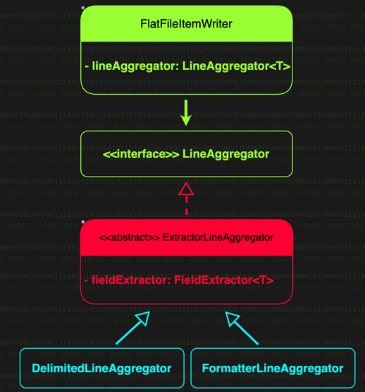
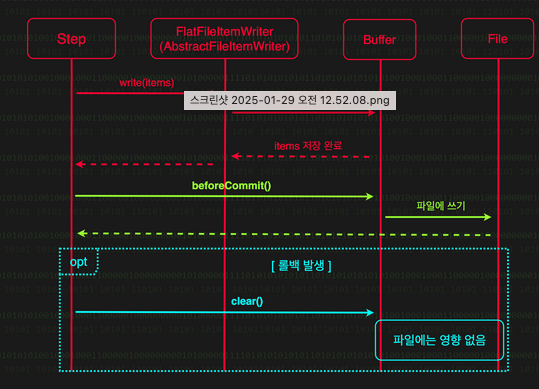

# FlatFileWriter (죽음을 파일에 새기다 ☠️)

- 데이터를 플랫 파일 형식으로 쓰는 작업을 담당

## 필드 추출과 라인 결합

- 파일에서 읽은 도메인 객체를 CSV 형식이나 커스텀 형식으로 변환하여 파일에 기록하는 역할을 `FieldExtrator` 와 `LineAggregator` 가 수행한다.

### 1단계: `FieldExtractor` (필드 추출)

- FieldExtractor 는 도메인 객체에서 필드를 추출하는 역할을 한다.

**`BeanWrapperFieldExtractor` vs `RecordFieldExtractor`: 필드 추출의 두 얼굴

- `BeanWrapperFieldExtractor` 는 java bean 객체로 부터 필드를 추출
- `RecordFieldExtractor` 는 java record 에서 필드를 추출하는 FieldExtractor, 레코드 컴포넌트의 accessor 메서드를 호출하여 값을 가져온다.
- Spring Batch 는 파일에 쓸 도메인 객체의 타입에 따라 두 구현체 중 하나를 자동으로 선택한다. 도메인 객체가 Java Bean 이면 `BeanWrapperFieldExtractor` 가 사용되고,
  Java Record 이면 `RecordFieldExtractor` 가 사용된다.

### 2단계: `LineAggregator` (문자열 결함)

- `LineAggregator` 는 FieldExtractor 에서 추출한 데이터를 하나의 문자열로 결합하는 역할을 맡는다.
- CSV 형식으로 결합할 수 있고, 커스텀 형식으로 데이터를 포맷할 수도 있다.
- 구분자 기반 형식의 파일을 읽을 때 DelimitedLineTokenizer 가 사용된 것 처럼, 구분자 기반 형식으로 파일을 쓸때는 `DelimitedLineAggregator` 가 사용된다.
- 또한, 고정 길이 형식을 포함한 다른 형식으로 파일을 쓸 때는 `FormatterLineAggregator` 를 사용할 수 있다.



```java
// FlatFileItemWriter.doWrite() -> write()에서 호출
public String doWrite(Chunk<? extends T> items) {
  StringBuilder lines = new StringBuilder();
  for (T item : items) {
    lines.append(this.lineAggregator.aggregate(item)).append(this.lineSeparator);
  }
  return lines.toString();
}
```

- FlatFileWriter 는 객체를 한 줄의 문자열로 만들어 파일에 쓴다. 이때 실제 객체 -> 문자열 변환은 LineAggregator 가 담당하는데, `DelimitedLineAggregator` 와
  `FormatterLineAggregator` 중 하나를 쓴다.
- DelimitedLineAggregator와 FormatterLineAggregator는 ExtractorLineAggregator를 상속한다. 이 ExtractorLineAggregator 계열의
  LineAggregator 구현체는 내부적으로 FieldExtractor를 사용해 객체로부터 필드를 추출한다. FieldExtractor 구현체로는 BeanWrapperFieldExtractor와
  RecordFieldExtractor가 사용되는데, Spring Batch는 도메인 객체의 타입에 따라 적절한 구현체를 자동으로 선택한다.
- names() 메서드는 자동 구성 방식에서만 사용된다는 사실에 주의하라. fieldExtractor() 메서드를 사용해 FieldExtractor 객체를 직접 전달한 경우에는 names() 메서드 설정은
  무시된다.

> 실습
> - bootRun 실행
> ```shell
> ./gradlew bootRun --args='--spring.batch.job.name=deathNoteWriteJob outputDir=src/main/java/com/system/batch/session3/작전2'
> ```

## RecordFieldExtractor 적용: Record 타입으로 파일 쓰기

- 기존의 `DeathNote` 클래스를 Record 로 변경하면 끝

```java
public record DeathNote(
    String victimId,
    String victimName,
    String executionDate,
    String causeOfDeath
) {
}
```

> FileExtractor 자동 구성의 `names()` 설정  
> 현재 FlatFileItemWriterBuilder 는 sourceType() 에 지정한 객체의 타입과 상관 없이 항상 `names()` 를 호출하고 있다.  
> 다시 말해 RecordFieldExtractor 를 사용할 떄도 `names()` 를 반드시 호출해 주어야 한다.

### fieldExtractor() 를 사용한 커스텀 FieldExtractor 의 구성

```java

@Bean
@StepScope
public FlatFileItemWriter<DeathNote> deathNoteWriter(
    @Value("#{jobParameters['outputDir']}") String outputDir) {
  return new FlatFileItemWriterBuilder<DeathNote>()
      .name("deathNoteWriter")
      .resource(new FileSystemResource(outputDir + "/death_notes.csv"))
      .delimited()
      .delimiter(",")
      .fieldExtractor(fieldExtractor())
      .headerCallback(writer -> writer.write("처형ID,피해자명,처형일자,사인"))
      .build();
}

public RecordFieldExtractor<DeathNote> fieldExtractor() {
  RecordFieldExtractor<DeathNote> fieldExtractor = new RecordFieldExtractor<>(DeathNote.class);
  fieldExtractor.setNames("victimId", "executionDate", "causeOfDeath");
  return fieldExtractor;
}
```

1. 커스텀 FieldExtractor 의 생성

- 직접 생성한 RecordFieldExtractor 객체에 `setNames()` 메서드를 사용해 파일에 쓸 필드(Record Component) 의 이름을 지정해준다.

2. `fieldExtractor()` 메서드를 통한 직접 전달

- 앞서 생성한 커스텀 FieldExtractor 를 FlatFileItemWriterBuilder 의 `fieldExtractor()` 메서드에 전달하며 직접 전달 방식 이므로 `sourceType()`, 와
  `names()` 는 제거한다.

## 커스텀 포맷 형식으로 파일 쓰기

- 커스텀 파일 포맷으로 데이터를 파일에 쓰기 위해서는 FormatterLineAggregate 를 사용해야 한다.
- `FormatterLineAggregator` 는 객체의 필드를 지정된 포맷에 맞춰 문자열로 변환한다.
- 고정 길이 형식의 파일이나 특별한 형식의 보고서를 만들 때 사용하기 좋다.

```java

@Bean
@StepScope
public FlatFileItemWriter<DeathNote> deathNoteWriter(
    @Value("#{jobParameters['outputDir']}") String outputDir) {
  return new FlatFileItemWriterBuilder<DeathNote>()
      .name("deathNoteWriter")
      .resource(new FileSystemResource(outputDir + "/death_note_report.txt"))
      .formatted()
      .format("처형 ID: %s | 처형일자: %s | 피해자: %s | 사인: %s")
      .sourceType(DeathNote.class)
      .names("victimId", "executionDate", "victimName", "causeOfDeath")
      .headerCallback(writer -> writer.write("================= 처형 기록부 ================="))
      .footerCallback(writer -> writer.write("================= 처형 완료 =================="))
      .build();
}
```

실행 결과

```text
> cat death_note_report.txt
================= 처형 기록부 =================
처형 ID: KILL-001 | 처형일자: 2024-01-25 | 피해자: 김배치 | 사인: CPU 과부하
처형 ID: KILL-002 | 처형일자: 2024-01-26 | 피해자: 사불링 | 사인: JVM 스택오버플로우
처형 ID: KILL-003 | 처형일자: 2024-01-27 | 피해자: 박탐묘 | 사인: 힙 메모리 고갈
================= 처형 완료 ==================
```

- `formatted()`: `delimited()` 대신 사용되었다. FlatFileItemWriter 가 사용할 LineAggregator 구현체로 `FormatterLineAggregator` 를 지정한다.
  FormatterLineAggregator 는 객체의 각 필드를 지정된 포맷 문자열에 맞춰 하나의 문자열로 변환한다.

## 파일 처리 옵션

- `shouldDeleteIfExists`: 기존 파일의 처형 여부 (`FlatFileItemWriterBuilder.shouldDeleteIfExists()` 를 사용하여 지정)
  - 기본값은 `true`. 기존 파일이 있다면 삭제하고 새로 파일을 생성
  - `false` 상태에서 기존에 파일이 존재하는 경우 **예외**를 발생
- `append`: 기존 파일에 데이터 덧붙이기 여부 (`FlatFileItemWriterBuilder.append()` 메서드를 사용해 지정)
  - 기본값은 `false`. 기존 파일을 삭제하지 않고 내용을 덧붙이고 싶은 경우
- `shouldDeleteIfEmpty`: 빈 파일 처리 여부 (`FlatFileItemWriterBuilder.shouldDeleteIfEmpty()` 를 사용하여 지정)
  - 기본값은 `false`. `header`와 `footer` 를 제외한 데이터가 없는 경우 파일을 삭제할지의 옵션
  - `append` 가 `true` 일 경우 아무 데이터를 쓰지 않게 되면 기존의 파일이 같이 삭제될 수 있음

## FlatFileItemWriter의 롤백 전략: 버퍼링을 통한 안전한 파일 쓰기

- DB와 달리 파일은 이미 쓰여진 데이터를 롤백할 수 없다는 문제가 있다.
- 이 문제를 해결하기 위하여 FlatFileItemWriter 는 데이터를 즉시 파일에 쓰지 않고 내부 버퍼에 일시적으로 저장해 둔다.
- 이 후 청크 처리가 정상적으로 완료되어 트랜잭션이 커밋되려고 할 때, 즉 `beforeCommit()` 콜백이 호추뢸 때 비로소 버퍼의 데이터를 파일에 쓴다.
- 덕분에 중간에 롤백이 발생하더라도 실제 파일에는 아무 데이터가 남지 않게 된다.
  
- `transactional()` 옵션으로 설정 가능하며 기본값은 `true` 이다.

## 파일 쓰기와 OS 캐시: forceSync 옵션

- OS 는 성능을 위하여 매번 디스크에 직접 쓰지 않고 메모리 캐시에 데이터를 먼저 저장한다.
- 디스크 I/O 비용이 크기 때문이다. 그러나 이로 인하여 갑자기 OS 가 중단되면 캐시의 데이터가 디스크에 쓰이지 못하고 유실될 수 있다.
- `FlatFileItemWriterBuilder`는 이러한 동작을 개발자가 쉽게 제어할 수 있도록 `forceSync()` 메서드를 제공한다. 이 값을 `true` 로 설정하면 캐시가 아닌 디스크에 즉시
  동기화되어 OS 중단이나 파일 시스템의 문제가 발생하여도 데이터 손실 위험이 줄어든다. 하지만 성능저하가 발생할 수 있다.
- 기본값은 `false` 이다.

## Record 타입 필드 추출하기 : RecordFileExtractor

```java
public record DeathNote(
    String victimId,
    String victimName,
    String executionDate,
    String causeOfDeath
) {
}
```

- FlatFileItemWriterBuilder 에 `sourceType` 메서드를 체이닝하여 record 타입 클래스를 전달
- `sourceType()`에 record 타입 클래스가 전달되면 Spring Batch 는 `BeanWrapperFieldExtractor` 대신 `RecordFieldExtractor` 를
  LineAggregator 로 지정한다.
- 단, `sourceType()` 메서드가 `names()` 호출전에 와야 한다.

```text
return new FlatFileItemWriterBuilder<DeathNote>()
        .name("deathNoteWriter")
        .resource(new FileSystemResource(outputDir + "/death_note_report.txt"))
        .formatted()
        .format("처형 ID: %s | 처형일자: %s | 피해자: %s | 사인: %s")
        .sourceType(DeathNote.class) //sourceType() 메서드에 record class를 전달
        .names("victimId", "executionDate", "victimName", "causeOfDeath")
        .headerCallback(writer -> writer.write("================= 처형 기록부 ================="))
        .footerCallback(writer -> writer.write("================= 처형 완료 =================="))
        .build();
```

## 대용량 파일의 분할 처리: MultiResourceItemWriter

- 한 번에 1000만 건의 데이터를 저장해야할 때 를 가정했을때, 하나의 파일에 저장한다면 여러 문제가 발생한다.
- 대용량 데이터를 효율적으로 관리하기 위해서 Spring Batch 는 `MultiResourceItemWriter` 를 제공한다.
- 여러 개의 리소스에 데이터를 분배하는 ItemWriter 구현체이다.

### 실습

- [DeathNoteMultiItemWriteJobConfig](DeathNoteMultiItemWriteJobConfig.java)

1. `ListItemReader` 구성하기
2. `delegateItemWriter` 구성

- `MultiResourceItemWriter` 는 직접 파일을 쓰지 않고, 실제 파일 쓰기 작업을 처리할 ItemWriter 에 작업을 위임한다.
- `MultiResourceItemWriter` 각 설정의 역할
  - `name()`: MultiResourceItemWriter 식별을 위한 고유 이름
  - `resource()`: MultiResourceItemWriter 를 사용할 땐 위임 대상 ItemWriter 대신 MultiResourceItemWriter 구성 코드에 Resource 를 지저앻
    주어야
    한다. 위임 대상 ItemWriter 에 Resource 를 지정해주는 역할은 `MultiResourceItemWriter` 내부적으로 수행한다.
  - `itemCountLimitPerResource`: 한 파일당 최대 라인 수를 지정한다.
  - `delegate`: 실제 파일 쓰기를 수행할 위임 대상 ItemWriter 를 설정한다.
  - `resourceSuffixCreator`: 파일 기본 이름 뒤에 붙을 접미사를 정의한다.

3. 실행

```shell
./gradlew bootRun --args='--spring.batch.job.name=deathNoteMultiItemWriteJob outputDir=src/main/java/com/system/batch/session3/작전2'
```

## 작전명: 분산 서버 로그 처형 작전

- 각 서버가 독립적인 로그 파일을 생성하고 있을때, 모든 서버의 로그를 수집 및 분석


1. 처형장 준비: 수집한 로그를 저장할 처형장(디렉토리)를 준비
2. 로그 수집: 여러 서버에서 로그 파일들을 수집한다.
3. 로그 처리: 수집된 로그를 읽고(read), 처리(process)하여, 결과 파일로 저장(write)

### 실습

[LogProcessingJobConfig.java](LogProcessingJobConfig.java)

**작전 수행 구성 (`logProcessingJob`)**

- `createDirectoryStep`: 로그 처리에 필요한 디렉토리 생성
- `logCollectionStep`: 서버들의 로그 파일을 수집
- `logProcessingStep`: 수집된 로그 파일 가공 및 저장

1. 1단계: 처형장 준비 (`createDirectoryStep`)

- JobParameters에 접근하여 date 파라미터를 입력 받는다. 이를 통해 날짜별로 독립적인 디렉토리를 생성하여 로그를 체계적으로 관리할 수 있다.
- SystemCommandTasklet.setWorkingDirectory() 메소드로 작업 디렉토리를 설정한다. 예제에서는 홈 디렉토리로 설정하였으나 실전에서는 운영 환경에 맞게 적절한 디렉토리를 지정하면
  된다.
- mkdir 명령으로 로그 수집용 디렉토리(collected_ecommerce_logs)와 수집된 로그의 처리 결과를 저장할 디렉토리(processed_logs)를 생성한다. -p 옵션으로 상위 디렉토리까지
  함께
  생성한다.

2. 2단계: 로그 수집 (`logCollectionStep`)

- `localhost` 서버에서 로그 파일들을 수집

3. 3단계: 로그 처리 (`logProcessingStep`)

**실행**

1. 홈 디렉토리에 `ecommerce_logs` 디렉토리를 먼저 생성

```shell
mkdir ~/ecommerce_logs
```

2. 명령어를 실행하여 로그 파일을 생성

```shell
> cat << EOF > ~/ecommerce_logs/2023-09-18.log
2023-09-18T10:15:30.123+09:00,INFO,Application started successfully
2023-09-18T10:16:45.456+09:00,DEBUG,Connecting to database: jdbc:mysql://localhost:3306/mydb
2023-09-18T10:17:20.789+09:00,INFO,User 'admin' logged in
2023-09-18T10:18:05.012+09:00,WARN,High memory usage detected: 85%
2023-09-18T10:19:30.345+09:00,ERROR,Failed to process transaction. ERROR_CODE[E001]
2023-09-18T10:20:15.678+09:00,INFO,Scheduled backup started
2023-09-18T10:21:40.901+09:00,DEBUG,Cache hit ratio: 78.5%
2023-09-18T10:22:55.234+09:00,INFO,New user 'jsmith' registered
2023-09-18T10:23:10.567+09:00,WARN,Disk space running low on /dev/sda1
2023-09-18T10:24:25.890+09:00,ERROR,Unable to send email. SMTP server not responding. ERROR_CODE[E002]
EOF
```

3. `localhost`와 `scp` 를 사용하기 위한 준비

- Mac 사용자: `시스템 환경설정` > `공유` --> `원격 로그인` 을 `ON` 으로 설정

4. job 실행하기

```shell
./gradlew bootRun --args='--spring.batch.job.name=logProcessingJob date=2023-09-18'
```