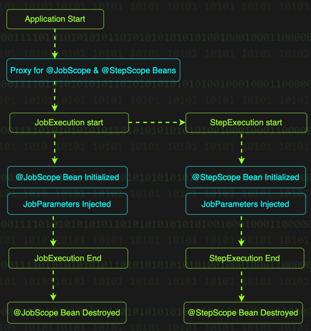
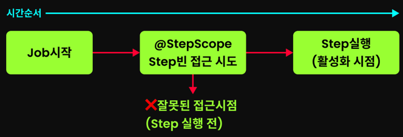

# 섹션 2. SYSTEM BUILD: 스프링 배치 종결의 첫 걸음

## Tasklet Batch 실행

```shell
./gradlew bootRun --args='--spring.batch.job.name=zombieCleanupJob'
```

> `PlatformTransactionManager` 빈 직접 정의할 땐 주의가 필요하다.  
> Spring Batch 는 내부적으로 Job 과 Step 의 상태와 같은 메타데이터를 DB를 통해 관리한다.  
> 이 때도 트랜잭션이 사용되는데, 별도의 구성 변경 없이 PlatformTransactionManager 를 빈으로 정의할 경우,  
> Step 의 비즈니스 로직 처리를 위한 트랜잭션과 메타데이터 관리를 위한 트랜잭션이 서로 다른 성격임에도 불구하고 같은
> PlatformTransactionManager 빈을 사용하게 되어 의도치 않은 문제가 발생할 수 있음

## JobParameters

1. 커맨드라인에서 잡 파라미터 전달하기

- 스프링 부트 3 과 스프링 배치 5를 기준으로 커맨드라인에서 Job 을 실행할 때의 파라미터 전달 방식

   ```shell
   ./gradlew bootRun --args='--spring.batch.job.name=dataProcessingJob inputFilePath=/data/input/users.csv,java.lang.String'
  ```
  `key=value,type` 으로 이루어진 잡 파라미터 전달 형태

**JobParameters** 기본 표기법  
`parameterName=parameterValue,parameterType,identificationFlag`

- `parameterName`: 배치 Job 에서 파라미터를 찾을 때 사용할 key 값
- `parameterValue`: 파라미터의 실제 값
- `parameterType`: 파라미터의 타입 (`java.lang.String`, `java.lang.Integer` 와 같은 fully qualified name 사용). 파라미터 타입을 사용하지 않을 경우
  `String` 타입으로 가정
- `identificationFlag`: Spring Batch 에게 해당 파라미터가 JobInstance 식별에 사용될 파라미터인지 여부를 전달하는 것으로 `true` 이면 식별에 사용. 생략하는 경우
  `true` 가 default

```shell
./gradlew bootRun --args='--spring.batch.job.name=dataProcessingJob inputFilePath=/data/input/users.csv,java.lang.String userCount=5,java.lang.Integer,false'
```

- 커맨드라인을 이용한 JobParameters 전달 방법
- 여러 파라미터 전달시 공백을 활용

## 다양한 타입의 Job 파라미터 지배하기

1. 기본 데이터 타입 파라미터 전달

- SystemTerminatorConfig > processTerminatorJob 실행
  ```shell
  ./gradlew bootRun --args='--spring.batch.job.name=processTerminatorJob terminatorId=KILL-9,java.lang.String targetCount=5,java.lang.Integer'
  ```
- `@Value` 를 사용해서 잡 파라미터를 전달받기 위해서는 `@StepScope` 와 같은 어노테이션이 필수

2. 날짜와 시간 파라미터 전달 (`LocalDate`와 `LocalDateTime` 파라미터 전달)

- TerminatorConfig > terminatorJob 실행
  ```shell
  ./gradlew bootRun --args='--spring.batch.job.name=terminatorJob executionDate=2024-01-01,java.time.LocalDate startTime=2024-01-01T14:30:00,java.time.LocalDateTime'
  ```
- `executionDate`는 `yyyy-MM-dd`
- `startTime`은 `yyyy-MM-ddThh:mm:ss` 형식을 사용

3. `Enum` 파라미터 전달

- 먼저, Enum 을 정의

   ```java
   public enum QuestDifficulty {EASY, NORMAL, HARD, EXTREME}
   ```

- 커맨드라인 실행
  ```shell
  ./gradlew bootRun --args='--spring.batch.job.name=enumTerminationJob questDifficulty=HARD,com.system.batch.session2.EnumTerminatorConfig$QuestDifficulty'
  ```
  - `Enum` 클래스인 `QuestDifficulty` 를 `$` 기호를 통해 외부/내부 클래스를 구분

4. `POJO` 를 활용한 Job 파라미터 주입
    ```java
    @StepScope
    @Component
    public class SystemInfiltrationParameters {
        private final String operationCommander;
        @Value("#{jobParameters[missionName]}")
        private String missionName;
        private int securityLevel;
        
        public SystemInfiltrationParameters(
        @Value("#{jobParameters['operationCommander']}") String operationCommander
        ) {
        this.operationCommander = operationCommander;
        }
        
        @Value("#{jobParameters[securityLevel]")
        public void setSecurityLevel(int securityLevel) {
        this.securityLevel = securityLevel;
        }
    }
    ```

- `@Component` 애노테이션으로 Spring 빈 등록된다.
- 잡 파라미터를 전달 받기 위해서는 `@StepScope` 와 같은 애노테이션이 필요하다
- `@Value("#{jobParameters[...]}")` 어노테이션을 사용하여 다양한 방식으로 Job 을 주입받을 수 있다.
- POJO 스프링 배치 커맨드 실행
  ```shell
  ./gradlew bootRun --args='--spring.batch.job.name=pojoTerminationJob missionName=안산_데이터센터_침투,java.lang.String operationCommander=KILL-9 securityLevel=3,java.lang.Integer,false'
  ```

## 기존 파라미터 표기법의 한계

- Spring Batch 의 기본 파라미터 표기법에는 한계가 있다. 예를 들어, 다음과 같은 파라미터를 보자.
  - `infiltrationTargets=판교_서버실,안산_데이터센터,java.lang.String`
  - 파라미터 값에 `,` 가 포함되면 어떻게 될까?
  - `ClassNotFoundException` 에러가 발생한다.
  - **Spring Batch 5** 부터는 `JSON` 기반의 파라미터 표기법을 새롭게 제공한다.

## JobParameters 의 JSON 기반 표기법

```text
infiltrationTargets='{"value": "판교_서버실,안산_데이터센터", "type": "java.lang.String"}'
```

- 표기법 구성 요소들 `value`, `type`, `identifying` 은 기본 표기법과 동일한 의미를 가진다.
- `identifying` 은 생략이 가능하다.

## JSON 기반 파리미터 표기법 사용을 위한 준비

```groovy
dependencies {
    // 기존 다른 의존성들...
    implementation 'org.springframework.boot:spring-boot-starter-json'
}
```

- Configuration 클래스에 JobParameterConverter Bean 추가

```java

@Configuration
public class BatchConfig {

  @Bean
  public JsonJobParametersConverter jobParameterConverter() {
    return new JsonJobParametersConverter();
  }
}
```

- `@EnableBatchProcessing` 은 스프링 배치 5 이상에서는 필요하지 않음.

- 커맨드 라인 실행
  ```shell
  ./gradlew bootRun --args="--spring.batch.job.name=jsonTerminationJob infiltrationTargets='{\"value\":\"판교서버실,안산데이터센터\",\"type\":\"java.lang.String\"}'"
  ```
  - `Gradle` 로 실행할 때는 `"` 를 이스케이프 처리해 주어야 함
- `java -jar` 명령어로 실행시 JSON 파라미터 표기법을 그대로 사용할 수 있음
  ```shell
  java -jar kill-batch-system-0.0.1-SNAPSHOT.jar --spring.batch.job.name=jsonTerminationJob infiltrationTargets='{"value":"판교_서버실,안산_데이터센터","type":"java.lang.String"}'
  ```
- `Intellij` program arguments 입력 시
  ```text
  --spring.batch.job.name=terminatorJob infiltrationTargets={\"value\":\"판교_서버실,안산_데이터센터\",\"type\":\"java.lang.String\"}
  ```

## 커맨드라인 파라미터는 어떻게 실제 Job 으로 전달될까?

- 애플리케이션 구동시 `JobLauncherApplicationRunner` 라는 컴포넌트가 자동으로 동작
- 해당 컴포넌트는 `ApplicationRunner`의 한 종류로, 커맨드라인으로 전달된 Spring Batch JobParameters 를 해석하고 Job 실행의 역할을 맡음

**JobLauncherApplicationRunner** 처리 과정

1. Job 목록 준비: `ApplicationContext` 에 등록된 모든 Job 타입 bean 이 JobLauncherApplicationRunner 에 자동 주입
2. 유효성 검증

- 만약, Job 타입의 빈이 여러개인데 `--spring.batch.job.name` 을 지정하지 않는 경우 검증 실패.
- 전달한 `job.name` 을 찾을 수 없는 경우 검증 실패

3. 명령어 해석: 커맨드라인으로 전달된 값을 파싱. `key=value` 형태의 인자들을 JobParameters 로 변환. 이 과정에서 `DefaultJobParametersConverter`(또는
   `JsonJobParametersConverter`) 가 사용되어 문자열을 변환
4. Job 실행: 주입받은 Job 목록에서 `--spring.batch.job.name` 에 해당하는 Job 찾기. 해당하는 Job 을 앞서 변환된 `JobParameters`와 함께 실행한다. 이 과정에서
   `JobLauncher` 라는 Job 을 실행시키는 컴포넌트가 사용됨

## 프로그래밍 방식으로 JobParameters 생성/전달하기

프로그래밍 방식으로 JobParameters를 생성/전달하려면 `JobParametersBuilder` 라는 컴포넌트가 필요

```java
JobParameters jobParameters = new JobParametersBuilder()
    .addJobParameter("inputFilePath", "/data/input/users.csv", String.class)
    .toJobParameters();
jobLauncher.

run(dataProcessingJob, jobParameters);
```

## JobParametersValidator

JobParametersValidator 를 사용하면 잘못된 파라미터가 들어오는 순간 즉시 차단할 수 있다.

```java
public interface JobParametersValidator {
  void validate(@Nullable JobParameters parameters) throws JobParametersInvalidException;
}
```

- JobParametersValidator 는 하나의 메서드를 가진다.
- `SystemDestructionJob` 의 실행
  ```shell
  ./gradlew bootRun --args='--spring.batch.job.name=systemDestructionJob destructionPower=6,java.lang.Long'
  ```
- 실행전 BatchConfig 의 jobParameterConverter 확인 (주석 처리)
- 파라미터 검증을 위매 매번 `JobParametersValidator` 를 구현하는 대신 `DefaultJobParametersValidator` 를 활용할 수 있다.
  - 단순히, 파라미터의 존재 여부만 확인하면 되는 경우 가능 가능하다.
  ```java
  @Bean
  public Job defaultSystemDestructionJob(JobRepository jobRepository, Step systemDestructionStep) {
    return new JobBuilder("defaultSystemDestructionJob", jobRepository)
        .validator(new DefaultJobParametersValidator(
            new String[]{"destructionPower"},  // 필수 파라미터
            new String[]{"targetSystem"}       // 선택적 파라미터
        )).start(systemDestructionStep)
        .build();
  }
  ```
  - `destructionPower`: 필수
  - `targetSystem`: 선택적
  - 그 외의 파라미터는 허용하지 않음
  - 필수 파라미터의 존재 여부만 전달하고 선택적 파라미터는 자유롭게 두고 싶다면 `new String[]{}` 를 전달하면 된다.
  ```shell
  ./gradlew bootRun --args='--spring.batch.job.name=defaultSystemDestructionJob destructionPower=10,java.lang.Long, targetSystem=duckbill'
  ```

## Job 과 Step 의 Scope 이해하기

- JobScope, StepScope 가 선언된 빈은 애플리케이션 구동 시점에는 프록시 객체로만 존재한다. 그 후 Job 이나 Step 이 실행된 후에 프록시 객체에 접근을 시도하면 그 때 실제 빈이 생성된다.
- JobScope 와 StepScope 의 생성부터 소멸까지의 과정
  

### @JobScope

- `@JobScope` 는 Job 이 실행되고 실제 빈이 생성되고, Job 이 종료될 때 함께 제거되는 스코프다.
- 즉, JobExecution 과 생명주기를 같이 한다. 이는 웹 요청이 들어올 때 빈이 생성도고 응답이 나갈 때 제거되는 Spring MVC 의 `@RequestScope` 와 비슷한 개념으로 보면 된다.

```java

@Bean
@JobScope
public Step systemDestructionStep(
    @Value("#{jobParameters['destructionPower']}") Long destructionPower) {
  return new StepBuilder("systemDestructionStep", jobRepository)
      .tasklet((contribution, chunkContext) -> {
        log.info("시스템 파괴 프로세스가 시작되었습니다. 파괴력: {}", destructionPower);
        return RepeatStatus.FINISHED;
      }, transactionManager)
      .build();
}
```

- 지연된 빈 생성 (Lazy Bean Creation)
  - @JobScope 가 적용된 빈은 애플리케이션 구동 시점에는 프록시만 생된다. 이후 실제 Job 이 실행되는 시점에 Bean 이 생성되고 종료될때 삭제된다.
- Job Parameter 와의 연동
  - 빈을 지연 생성함으로써 `JobParameters` 를 전달해서 Bean 에 주입하는 것이 가능하다.
- 병렬 처리 지원 (Parallel Processing Support)
  - `@JobScope` 를 사용하면 JobExecution 마다 별도의 빈이 생성되어 동시성 문제를 방지할 수 있다.

### StepScope

- @StepScope 는 @JobScope 와 유사하지만 Step 레벨에서 동작하는 스코프이다.
- 만약, 동시에 여러 Step 동작하더라도, @StepScope 가 있기 떄문에 각 Step 실행마다 독립적인 Tasklet 인스턴스가 생성됨

### JobScope, StepScope 사용시 주의사항

1. 프록시 대상의 타입이 클래스인 경우 반드시 상속 가능한 클래스이여야 한다.
   @JobScope 의 정의를 한번 살펴보자.

```java

@Scope(value = "job", proxyMode = ScopedProxyMode.TARGET_CLASS)
@Retention(RetentionPolicy.RUNTIME)
@Documented
public @interface JobScope {
}
```

- 이 스코프는 `CGLIB` 를 사용하여 프록시를 생성한다.

2. Step 빈에는 `@StepScope`와 `@JobScope`를 사용하지 말것

- Spring Batch Step 에 `@StepScope`를 달면 Step 빈 생성과 스코프 활성화 시점이 맞지 않아 오류가 발생

```java

@Bean
@StepScope
public Step systemDestructionStep(
    SystemInfiltrationTasklet tasklet
) {
  return new StepBuilder("systemDestructionStep", jobRepository)
      .tasklet(tasklet, transactionManager)
      .build();
}
```

- 위와 같이 `Step` 에 `@StepScope` 를 사용하는 경우 아래의 에러가 발생한다.

```text
org.springframework.beans.factory.support.ScopeNotActiveException: 
Error creating bean with name 'scopedTarget.systemDestructionStep': 
Scope 'step' is not active for the current thread
```

- Spring Batch 는 Step 실행 전 메타데이터 관리를 위해 Step 빈에 접근해야 한다.
- 문제는 이 시점 아직 Step 이 실행되지 않아 @StepScope 가 활성화되지 않은 상태라는 점이다.
  
- `Step` 에 `@StepScope` 를 사용하는 것 은 불가능하며, `Step`에 `@JobScope`를 사용하는 것 또한 권장되지 않는다.
  - 섹션5 에서 살펴볼 `JobOperator`를 통한 Step 실행 제어 시
  - 섹션6 에서 살펴볼 `Spring Integration(Remote Partitioning)`을 활용한 배치 확장 기능 사용 시
- Step 에서 JobParameters 를 활용하기 위한 옳바른 방법
- 기존 JobParameters 활용 방법 => `@JobScope` 를 활용하였음
  ```java
  @Bean
  @JobScope  // Step에 @JobScope를 달았다
  public Step systemDestructionStep(
     @Value("#{jobParameters['targetSystem']}") String targetSystem
  ) {
     return new StepBuilder("systemDestructionStep", jobRepository)
         .tasklet((contribution, chunkContext) -> {
             log.info("{} 시스템 침투 시작", targetSystem);
             return RepeatStatus.FINISHED;
         }, transactionManager)
         .build();
  }
  ```
- 옳바른 방법 => `Tasklet` 를 활용하자
  ```java
  @Bean
  public Step systemDestructionStep(
      SystemInfiltrationTasklet tasklet  // Tasklet을 주입받는다
  ) {
      return new StepBuilder("systemDestructionStep", jobRepository)
          .tasklet(tasklet, transactionManager)
          .build();
  }
  
  @Slf4j
  @Component
  @StepScope  // Tasklet에 @StepScope를 달았다
  public class SystemInfiltrationTasklet implements Tasklet {
      private final String targetSystem;
  
      public SystemInfiltrationTasklet(
          @Value("#{jobParameters['targetSystem']}") String targetSystem
      ) {
          this.targetSystem = targetSystem;
      }
  
      @Override
      public RepeatStatus execute(StepContribution contribution, ChunkContext context) {
          log.info("{} 시스템 침투 시작", targetSystem);
          return RepeatStatus.FINISHED;
      }
  }
  ```

### 컴파일 시점에 없는 값을 어떻게 참조할 것인가?

```java

@Bean
@JobScope
public Step systemDestructionStep(
    @Value("#{jobParameters['destructionPower']}") Long destructionPower
) {
  return new StepBuilder("systemDestructionStep", jobRepository)
      .tasklet((contribution, chunkContext) -> {
        log.info("시스템 파괴 프로세스가 시작되었습니다. 파괴력: {}", destructionPower);
        return RepeatStatus.FINISHED;
      }, transactionManager)
      .build();
}
```

- 위의 Step 에서는 `destructionPower` 를 입력받고 있다.
- 만약, `JobBuilder` 코드에서 이 systemDestructionStep() 메서드를 참조하려면 어떻게 할까?

```java
// 1. 빈 주입 방식
@Bean
public Job systemTerminationJob(Step systemDestructionStep) {  // Spring이 주입
  return new JobBuilder("systemTerminationJob", jobRepository)
      .start(systemDestructionStep)
      .build();
}

// 2. 메서드 직접 호출 방식
@Bean
public Job systemTerminationJob() {
  return new JobBuilder("systemTerminationJob", jobRepository)
      .start(systemDestructionStep(null))  // Job 파라미터 자리에 null 전달
      .build();
}
```

## ExecutionContext

- Spring Batch 는 JobExecution, StepExecution 을 활용하여 시작시간, 종료 시간, 실행 상태 같은 메타데이터를 관리
- 비즈니스 로직 처리 중 발생하는 커스텀 데이터를 관리할때 ExecutionContext 를 활용
- Job 이 재시작 되는 경우 특히 유용. Spring Batch 재시작시 ExecutionContext 의 데이터를 자동으로 복원하여 중단점 부터 처리할 수 있도록 지원함

```java

@Bean
@JobScope
public Tasklet systemDestructionTasklet(
    @Value("#{jobExecutionContext['previousSystemState']}") String prevState
) {
  // JobExecution의 ExecutionContext에서 이전 시스템 상태를 주입받는다
}

@Bean
@StepScope
public Tasklet infiltrationTasklet(
    @Value("#{stepExecutionContext['targetSystemStatus']}") String targetStatus
) {
  // StepExecution의 ExecutionContext에서 타겟 시스템 상태를 주입받는다
}
```

- Step의 ExecutionContext에 저장된 데이터는 @Value("#{jobExecutionContext['key']}")로 접근할 수 없다.
  - 즉, Step 수준의 데이터를 Job 수준에서 가져올 수 없다.
- 한 Step의 ExecutionContext는 다른 Step 에서 접근할 수 없다.
  - 예를 들어 StepA의 ExecutionContext에 저장된 데이터를 StepB에서 @Value("#{stepExecutionContext['key']}")로 가져올 수 없다.

## Spring Batch Listener 와 활용

### JobExecutionListener

- Job 실행의 시작과 종료 시점에 호출되는 리스너 인터페이스다.
- Job 실행 결과를 이메일로 전송하거나, Job 이 시작하기 전에 필요한 리소스를 준비하고 끝난 후에 정리하는 부가 작업을 수행

**afterJob()** 메서드는 잡 실행 정보가 메타데이터 저장소에 저장되기 전에 호출된다.  
이를 활용하면 특정 조건에 따라 Job 의 실행 결과 상태를 완료(`COMPLETED`) 에서 실패 (`FAILED`)로 변경하는 것도 가능하다.

```java
public interface JobExecutionListener {
  default void beforeJob(JobExecution jobExecution);

  default void afterJob(JobExecution jobExecution);
}
```

### StepExecutionListener

- Step 실행과 종료시점에 호출되는 리스너 인터페이스

```java
public interface StepExecutionListener extends StepListener {
  default void beforeStep(StepExecution stepExecution) {
  }

  @Nullable
  default ExitStatus afterStep(StepExecution stepExecution) {
    return null;
  }
}
```

- `afterStep` 메서드를 보면 ExitStatus 를 반환하는 것을 알 수 있는데, 이를 통해 afterStep() 에서 특정 조건에 따라 Step 의 실행 결과 상태를 직접 변경할 수 있다.

### ChunkListener

- ChunkListener 는 하나의 청크 단위 처리가 시작되기 전, 완료된 후, 그리고 에러가 발생했을 때 호출되는 리스너 인터페이스

```java
public interface ChunkListener extends StepListener {
  default void beforeChunk(ChunkContext context) {
  }

  default void afterChunk(ChunkContext context) {
  }

  default void afterChunkError(ChunkContext context) {
  }
}
```

- `afterChunk` 는 트랜잭션이 커밋된 후에 호출된다.
- 반면 청크 처리 도중 예외가 발생하는 경우 `afterChunkError` 가 호출되는데, 이는 청크 트랜잭션이 **롤백**된 이후에 호출된다.

